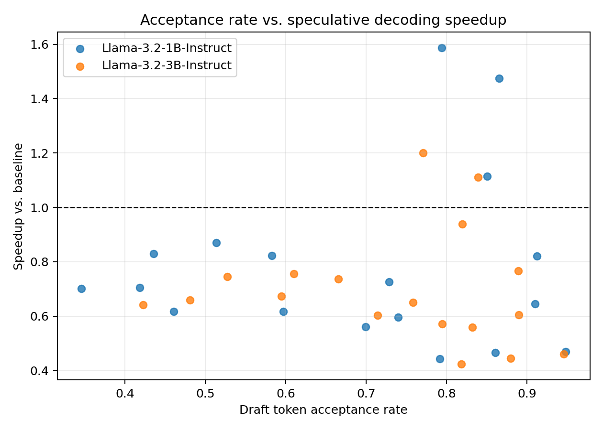
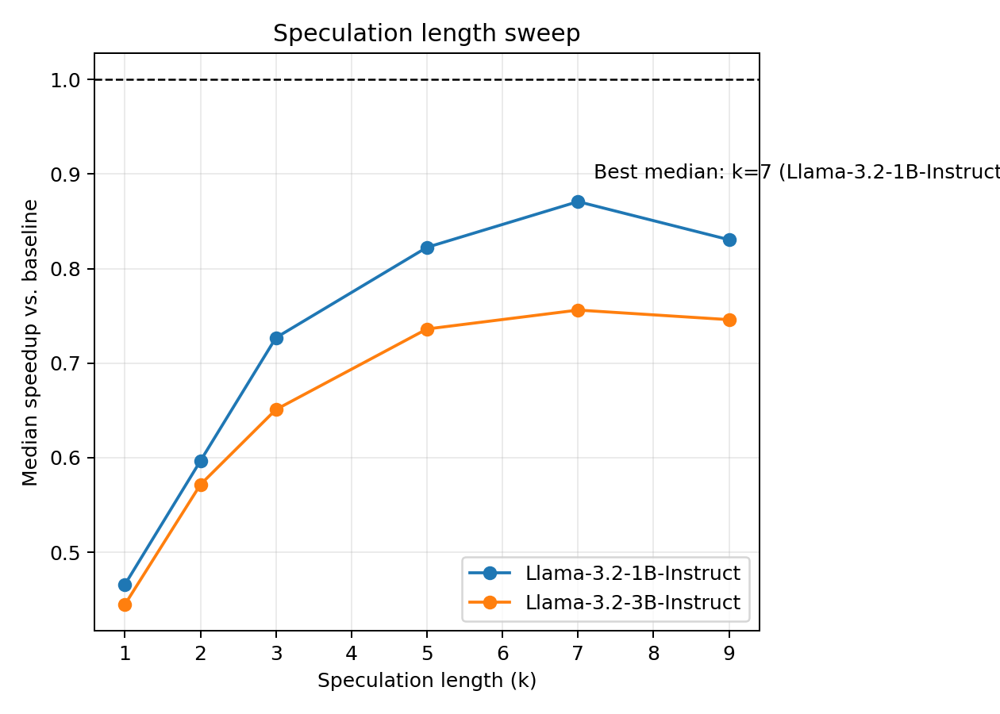
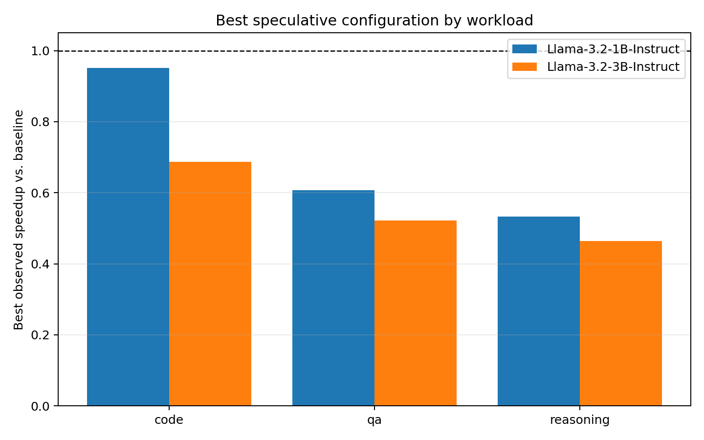
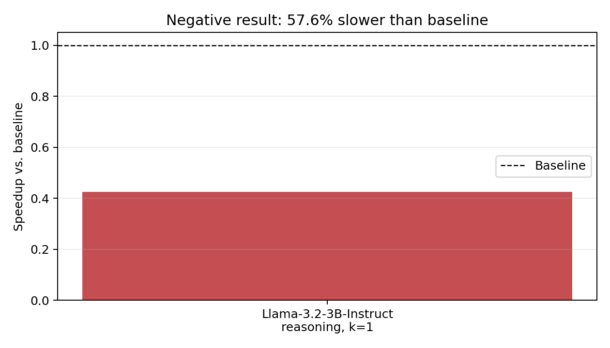

# Speculative Decoding from First Principles

I implemented speculative decoding from scratch on top of Hugging Face
Transformers, proved the modified rejection-sampling algorithm preserves the
target distribution, and measured the system from an initially slower-than-
baseline prototype to a **1.834x throughput speedup** on an RTX 3090. The key
was not the algorithm alone: persistent KV caches removed repeated prefill,
`torch.compile` plus a fixed `StaticCache` removed serial draft-launch
overhead, and adaptive speculation reduced target calls on predictable code.
**Pitch:** I built speculative decoding from first principles, characterized
both its mathematical correctness and its finite-precision boundary on real
GPUs, and showed exactly when draft-model speculation helps or hurts.

## Reproduce

The target is `meta-llama/Llama-3.1-8B-Instruct`; drafts are
`meta-llama/Llama-3.2-1B-Instruct` and `3B-Instruct`. Accept the model licenses
on Hugging Face before running.

```bash
git clone https://github.com/JoJojo1256/AIinferenceproj.git
cd AIinferenceproj

# Run on an Oscar GPU compute node, not a login node.
interact -q gpu -g 1 -f ampere -m 40g -n 4
bash env/setup.sh

export HF_TOKEN="<read-only-token>"
export HF_HOME="$HOME/scratch/hf_cache"
```

The committed jobs cover the full optimized sweep, optimization attribution,
and real-model correctness:

```bash
# 36 fixed-k configurations plus six adaptive configurations.
sbatch scripts/slurm_optimized_sweep.sh

# Paired baseline, eager cached control, compiled StaticCache, and adaptive k.
sbatch scripts/slurm_optimized_smoke.sh

# Real 8B+1B CUDA correctness and precision diagnostics.
sbatch scripts/slurm_gpu_equality.sh

# fp32 needs a high-memory GPU; the measured arm used a 48 GB L40S.
DTYPE=float32 sbatch scripts/slurm_gpu_equality.sh
```

The original uncached figures are historical artifacts from commit `ecfa92c`;
running today's `scripts/slurm_sweep.sh` uses the current cached implementation
and does not recreate that old code path.

The optimized measurements reported below use 128 new tokens, three discarded
warmups, five measured trials, and paired same-run target-only baselines.
Results store the git commit, hardware/software provenance, model IDs,
throughput, acceptance, stage timings, processed-token counts, cache/compile
settings, and realized speculation lengths. Generate the four summary plots
with:

```bash
# The measured JSONs live on the data branch rather than the code branch.
git fetch origin jojojo1256-optimized-benchmarks
git checkout origin/jojojo1256-optimized-benchmarks -- \
  results/raw/phase3_sweep_optimized_20260818T215822Z.json \
  results/raw/phase3_sweep_optimized_adaptive_20260818T215822Z.json

python analysis/make_figures.py \
  results/raw/phase3_sweep_optimized_20260818T215822Z.json
```

The adaptive JSON supplies the adaptive table and attribution discussion; the
four figures visualize the fixed-\(k\) matrix so adaptive runs are not
misclassified as fixed \(k=5\).

See [`GPU_ACCESS.md`](GPU_ACCESS.md) for Oscar and standalone Linux setup.

## Algorithm

For each block, the draft model proposes up to \(k\) tokens autoregressively
from distribution \(q\). The target scores the entire proposal in one forward
pass, producing distribution \(p\) at each position. For proposed token \(x\):

$$
P(\text{accept }x)=\min\left(1,\frac{p(x)}{q(x)}\right).
$$

If \(x\) is rejected, generation stops at that position and samples a corrected
token from:

$$
p'(y)=\frac{\max(0,p(y)-q(y))}
{\sum_z \max(0,p(z)-q(z))}.
$$

If every proposal is accepted, the target emits one bonus token. This modified
rejection rule exactly recovers the target distribution; it is not an
approximation. Greedy decoding is the deterministic special case: accept while
draft and target argmax agree, then emit the target argmax at the first
disagreement.

The optimized implementation preserves this algorithm while changing model
state management:

1. Prefill target and draft once, then carry persistent KV caches.
2. Verify only new proposal tokens and roll both caches back to the accepted
   prefix after rejection.
3. Compile the draft's fixed one-token decode with
   `torch.compile(mode="reduce-overhead")` and a reusable `StaticCache`.
4. Adapt \(k\): increase by two after full acceptance; otherwise decrease by
   one, with a floor of one and an optional cap.

Target `StaticCache` is optional because preallocating it for the 8B model adds
pressure on 24 GB GPUs. Draft `StaticCache` tracks logical length explicitly,
passes `cache_position`, pads attention masks to a fixed shape, clears rejected
slots, and reuses storage so CUDA graph addresses remain stable.

## Correctness

### Mathematical guarantee

In exact arithmetic, modified rejection sampling is distribution-preserving,
and greedy speculative decoding is output-identical to serial target decoding.
The CPU suite tests this bit-exactly across full acceptance; rejection at the
first, middle, and last proposal; corrected sampling; EOS/end-of-turn; exact
token limits; DynamicCache and StaticCache rollback; adaptive schedules; and
cache-length invariants.

```text
52 passed
```

### What real GPU arithmetic changes

The exact-arithmetic guarantee does **not** imply that two different GPU kernel
shapes must produce bit-identical low-precision logits. The real-model CUDA
gate compared baseline, eager cached speculation, compiled StaticCache, and
adaptive speculation over four code and four QA prompts with repeated compiled
replays:

| L40S precision | All gate checks | Cross-path greedy | Target-only shape-control logit delta | Argmax flips |
|---|---:|---:|---:|---:|
| fp32 | **73 / 73 passed** | **64 / 64** | 0.00003147–0.00008965 | 0 on all 8 prompts |
| bf16 | 17 / 73 passed | 8 / 64 | 0.31250000–0.53125000 | 6 across 5 prompts |

The 73 total checks comprise 64 cross-path greedy comparisons, eight baseline
determinism checks, and one sampled first-token distribution check.

The decisive control contains no speculative decoding. It teacher-forces the
same fixed target-token sequence two ways: one token per target forward versus
all tokens in one forward. In bf16, those shapes choose different kernel and
reduction paths; floating-point addition is non-associative, and near-tied
logits can flip argmax. This target-only control produced six argmax flips
across five prompts, showing directly that input shape alone can change bf16
greedy decisions without speculative control flow.

The 56 failed L40S bf16 cross-path comparisons first diverged at indices 7 (8
runs), 10 (8), 37 (8), 42 (5), 74 (3), 83 (8), 113 (8), and 123 (8), with
median 42. At those positions, the serial baseline's top-two gap was 0–0.125
logits while the maximum serial-versus-batched difference was 0.140625–0.25—
large enough to create or break a tie. In four of eight prompts, the first
speculative divergence exactly matched a target-only flip: code[2] at 113,
QA[0] at 123, QA[2] at 10, and QA[3] at 83. Four exact matches among
eight up-to-128-token generations are well above chance and are direct positive
evidence for the shape/reduction-order mechanism, but they are not a complete
explanation of all 56 failures. The control compares only serial scoring with
one full-length forward; the speculative loop presents many block widths as
\(k\) changes and therefore samples more reduction paths. These pre-`971d2cf`
result JSONs did not yet store divergence summaries, so the indices above were
parsed from the corresponding committed Slurm logs.

On the same L40S and code commit, fp32 reduced the target-only shape difference
by roughly 3,500–17,000x and eliminated all target-only argmax flips. Baseline
and speculative variants each repeated deterministically, ruling out run-to-run
nondeterminism.

A secondary bf16 run on an RTX A5500 passed 19/64 cross-path comparisons and
produced eight target-only flips across six prompts. One of those six prompts
had an exact first-divergence match (code[1] at 13), and its other flip and
divergence locations differed from the L40S run. Dtype controls the magnitude
and whether fp32 flips occur; GPU-specific kernel reduction order affects where
bf16 near-ties flip. These hardware-dependent locations support reduction-order
behavior rather than a fixed speculative control-flow defect.

Therefore the honest boundary is:

- the algorithm is exactly distribution-preserving mathematically;
- real fp32 generation was token-identical in all 64 cross-path greedy checks
  and passed all 73 total gate checks;
- same-card bf16 passed 8/64 cross-path greedy checks; baseline and speculative
  runs were deterministic, but serial and batched kernel paths were not
  universally token-identical near argmax ties.

Sampled first-token checks also matched: empirical total-variation distance was
0.0000 in both the reported fp32 and bf16 diagnostic runs.

### CUDA graph output lifetime

`reduce-overhead` can reuse output buffers. Hardware profiling observed
`cudaGraphLaunch`; an uncloned retained logit tensor shared reused storage and
was overwritten on replay, while the production `.clone()` remained unchanged.
The current loop consumes each logit before the next replay, so removing the
clone did not alter end-to-end tokens. The hazard is nevertheless real and
demonstrated at the buffer level; cloning makes that safety property explicit
rather than incidental.

## Results

### Acceptance rate versus speedup



Acceptance is necessary but not sufficient. The best configuration pairs high
agreement with a cheap draft and enough accepted tokens per target call:
adaptive \(k\), 1B draft, code workload reached **1.834x** at 0.805 acceptance
with realized median \(k=10\). A larger draft can agree more often yet lose
because each proposal costs more.

| Adaptive arm (initial \(k=5\), cap 15) | Acceptance | Speedup | Median realized \(k\) |
|---|---:|---:|---:|
| 1B, code | 0.805 | **1.834x** | 10 |
| 3B, code | 0.759 | 1.217x | 8 |
| 1B, QA | 0.536 | 0.854x | 5 |
| 3B, QA | 0.573 | 0.740x | 7 |
| 1B, reasoning | 0.473 | 0.666x | 4 |
| 3B, reasoning | 0.523 | 0.651x | 5 |

### Speculation length



Small \(k\) underutilizes each target verification; large \(k\) risks wasted
draft work after rejection. On 1B/code, fixed \(k=1\) achieved only 0.469x,
\(k=5\) crossed baseline at 1.115x, and \(k=9\) reached **1.587x**. Adaptive
speculation improved further to 1.834x by growing on full acceptance and
shrinking after rejection.

### Workload sensitivity



Code is structured and predictable enough to amortize target verification.
QA and reasoning are not for this model pair: the best 1B fixed-\(k\) results
were 0.871x on QA and 0.705x on reasoning. Adaptive \(k\) correctly shortened
low-agreement blocks, but could not overcome draft cost.

### Negative result



The worst optimized sweep case was the 3B draft on reasoning at \(k=1\):
**0.424x**, despite 0.819 acceptance. This is an important counterexample to
"high acceptance means speedup": one-token speculation cannot amortize a 3B
draft or reduce target calls enough to win.

### Optimization attribution

The final speedup came from measuring one bottleneck at a time:

| Arm | Code | QA |
|---|---:|---:|
| Eager + DynamicCache, fixed \(k=5\) | 0.808x | 0.578x |
| + compiled draft + StaticCache | 1.262x | 0.903x |
| + adaptive \(k\) | **1.753x** | 0.921x |

On code, cumulative draft-proposal time fell from **29,931 ms** to **11,942
ms**, then to **8,872 ms**. The first implementation had recomputed the entire
prefix every block with `use_cache=False`; all 30 configurations lost (best
0.95x, worst 0.41x). Persistent KV caching raised the best smoke result to
0.78x but was still slower. Profiling then showed 26.7 s in draft proposal
versus 7.6 s in target verification, motivating CUDA graphs and StaticCache.
Adaptive \(k\) converted the lower draft latency into fewer target passes.

## When It Helps—and When It Does Not

Speculative decoding helps when all three conditions hold:

- the draft is much cheaper than the target;
- agreement stays high over long enough blocks;
- accepted tokens per target verification outweigh serial draft launches.

The 1B/code pair satisfies those conditions. QA and reasoning acceptance is too
low, while the 3B draft often costs more than its modest agreement improvement
saves. Very small \(k\) also loses even at high acceptance because it barely
reduces target-forward count. The right question is not "does the draft agree?"
but "how many target calls does each millisecond of draft work eliminate?"

## What I Learned About Inference Performance

Algorithmic work and systems work were equally necessary. Caching removed an
obvious asymptotic waste but exposed a less obvious fixed-cost bottleneck: a 1B
draft can be latency-bound by Python dispatch and CUDA launches rather than
matrix multiplication. CUDA graphs with StaticCache solved that bottleneck;
adaptive depth then matched the algorithm to workload predictability. The
correctness investigation was just as instructive: a proof about distributions
does not guarantee bitwise equality between different finite-precision kernel
shapes. Target-only controls, not hand-waving about "numerical noise,"
established the boundary.

## Hardware and Reproducibility

- **Performance sweep:** RTX 3090, bf16, 128 new tokens, three warmups, five
  trials, paired same-run baselines; job 5074257.
- **Optimization attribution:** RTX 3090, bf16; job 5074092.
- **Correctness diagnostics:** same-commit L40S 48 GB runs in fp32 (job 5083353)
  and bf16 (job 5083454) isolate dtype on one GPU. An RTX A5500 bf16 run (job
  5083352) provides the secondary hardware-location control.
- **Models:** `meta-llama/Llama-3.1-8B-Instruct` target;
  `meta-llama/Llama-3.2-1B-Instruct` and `3B-Instruct` drafts. The runs used
  the default Hub revisions; result JSON records the model IDs and requested
  revision fields.
- **Software:** Python 3.11, PyTorch 2.7.1 CUDA 12.6 build, Transformers 4.53.1.
- **Artifacts:** optimized benchmark results, logs, and figures are preserved
  on `jojojo1256-optimized-benchmarks` at commit `dbc8f16`; implementation and
  diagnostic commits are recorded in each run's JSON.

Historical uncached and cached-negative results are retained unchanged rather
than overwritten or relabeled.
